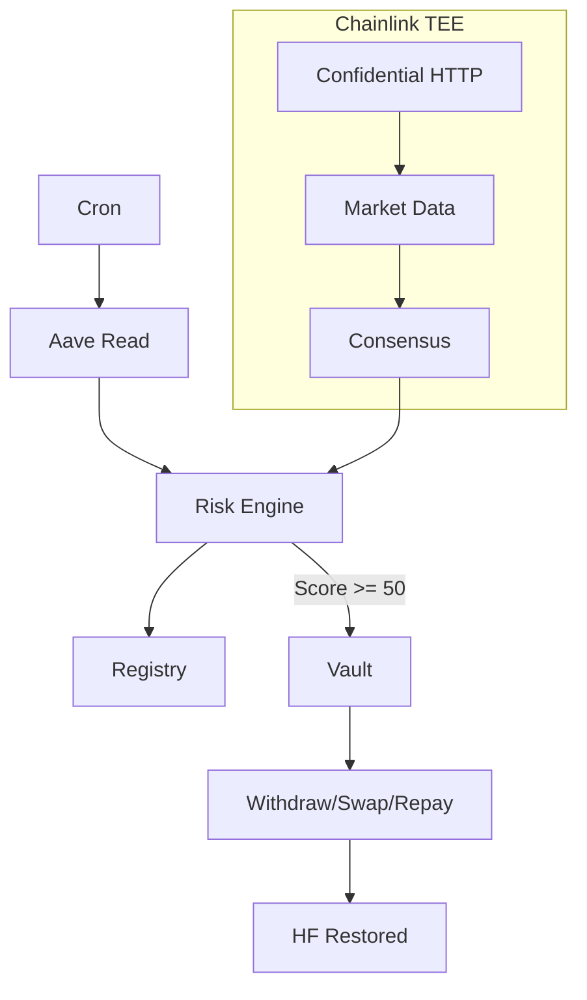

<div align="center">
  <h1 align="center">🛡️ SentinelVault</h1>
  <p align="center">
    <b>Autonomous multi-chain DeFi position protection powered by Chainlink CRE</b>
  </p>

  <p align="center">
    
    
    
    
  </p>

  <p align="center">
    
    
    
    
    
    
  </p>
</div>

---
### 🌟 Vision
To create a **set-and-forget safety net** for DeFi users. We believe that managing multi-chain wealth shouldn't require being glued to a screen 24/7. SentinelVault ensures your assets are protected from market crashes and liquidations automatically, providing peace of mind through decentralized, deterministic automation.

**The Perspective:**
*   **Without Sentinel:** You wake up to a 20% market crash, find your position liquidated, and lose your collateral to penalties.
*   **With Sentinel:** While you sleep, the vault detects the crash, repays your debt, and saves your position before liquidation even starts.

---
### What Problem It Solves
*   **Liquidation Risk:** Markets move fast. If ETH drops 20% while you're asleep, your Aave loan could be liquidated, costing you a 5-10% penalty plus lost collateral.
*   **Manual Monitoring Fatigue:** Checking Health Factors across multiple chains (Sepolia, Base, etc.) is exhausting and error-prone.
*   **Execution Complexity:** Manually withdrawing, swapping tokens, and repaying debt to "save" a position involves multiple transactions and high gas costs if not optimized.

### How This Actually Works and Helps
1.  **Always Watching:** SentinelVault runs a "security guard" script (Chainlink CRE) every 5 minutes.
2.  **Smart Assessment:** It checks your loans on different blockchains and calculates a "Risk Score" based on real-time market data (fetched securely).
3.  **Automatic Rescue:** If things get risky (Score > 50), it doesn't just alert you—it **acts**. It automatically withdraws a portion of your collateral, swaps it for stablecoins, and repays your debt in **one single transaction**.
4.  **Stay Safe:** This raises your "Health Factor" back to a safe level, preventing liquidation and saving your money before the crash hits.

---

SentinelVault monitors Aave V3 positions across multiple chains, scores risk deterministically, and writes protective actions to on-chain vault contracts that execute atomically — all orchestrated by a Chainlink CRE (Capability Runtime Environment) workflow.

Submitted to the **Chainlink CRE Hackathon — Convergence 2026** across the **DeFi**, **Privacy**, and **Risk & Compliance** tracks.

---
### Tech Stack & Dependencies

| Category | Tools & Libraries |
| :--- | :--- |
| **Smart Contracts** | Solidity (0.8.24), Foundry, OpenZeppelin, Aave V3 Protocols |
| **Automation (CRE)** | @chainlink/cre-sdk, Bun, Zod, Viem |
| **Frontend** | Next.js 14 (App Router), React 18, Tailwind CSS, Lucide Icons |
| **Scripts & Testing** | Ethers.js v6, ts-node, Dotenv, Forge-Std |
| **Security** | TEE (Trusted Execution Environments), ConfidentialHTTPClient |

---

## Architecture



---

## Track Entries

### DeFi Track
- Monitors live Aave V3 positions multiple chains (Sepolia + Base Sepolia)
- Atomic execution: withdraw → swap → repay in a single transaction
- `_safeWithdrawAmount()` caps withdrawal to keep HF ≥ 1.2 at all times
- Four protection levels: HOLD / REBALANCE (25%) / DELEVERAGE (50%) / EMERGENCY_EXIT
- Swap fallback: if DEX fails, WETH is held in vault — tx never reverts

### Privacy Track
- `ConfidentialHTTPClient` runs market data fetch inside the DON TEE enclave
- CryptoCompare API key injected via Go template `{{.marketDataApiKey}}` at runtime
- Key **never** appears in workflow code, config, or on-chain
- `ConsensusAggregationByFields` with `median()` ensures tamper-resistant aggregation
- `encryptOutput: false` — price data is public; privacy value is the key injection

### Risk & Compliance Track
- `SentinelRegistry` provides an immutable on-chain audit trail of every assessment
- Deterministic scoring algorithm (no ML, no randomness) — fully reproducible
- Every `onReport()` call logs: score, action, health factor, debt, chain, timestamp
- Export compliance JSON from the dashboard with one click

---

## Deployed Contracts

| Contract | Chain | Address |
|----------|-------|---------|
| SentinelVault | Sepolia (11155111) | `0xbc1B77fcAf2A23D63a63b1CB4529629b0A9f4572` |
| SentinelVault | Base Sepolia (84532) | `0x59d1102E37ECC1ff5cEde1D67D9C0C59f05f0A19` |
| SimpleMockDEX | Sepolia | `0xCc449B9F07CD57967A267056A21CF85f8A97b1bF` |
| SimpleMockDEX | Base Sepolia | `0xb8EfB0040C6Cb17116bBc0cB630FDcAf54A87625` |
| SentinelRegistry | Sepolia | `0xb246C21e878A1276B21761F9d946eC91Fb1Da73e` |

**Deployer:** `0x5042E61146F26a253697Ebf1C44F64E75EfccC9B`

---

## Quick Start

### Prerequisites
- [Foundry](https://getfoundry.sh/) — Solidity toolchain
- [Bun](https://bun.sh/) — package manager for CRE workflow
- [Node.js 18+](https://nodejs.org/) — for scripts and dashboard

### 1. Contracts

```bash
cd contracts
forge build
forge test
```

### 2. CRE Workflow

```bash
cd risk-assessment
bun install

# Simulate (no broadcast, log output only)
cre workflow simulate risk-assessment --target staging-settings

# Deploy to CRE gateway
cre workflow deploy risk-assessment --target staging-settings
```

Secrets required in `risk-assessment/secrets.yaml` (gitignored):
```yaml
secretsNames:
  marketDataApiKey:
    - MARKET_DATA_API_KEY_ALL
```

### 3. Dashboard

```bash
cd dashboard
npm install
npm run dev
# Open http://localhost:3000
```

### 4. Demo Scripts

```bash
cd scripts
npm install

# Verify live Aave positions on both chains
npx ts-node verify-positions.ts

# Trigger a risk event (lower HF via extra borrow)
npx ts-node trigger-risk.ts sepolia

# Simulate a vault action directly (no CRE required)
npx ts-node test-action.ts sepolia DELEVERAGE

# Set the CRE KeystoneForwarder on both vaults
npx ts-node set-forwarder.ts <forwarder-address>
```

---

## Risk Scoring Algorithm

| Signal | Points | Condition |
|--------|--------|-----------|
| **Health Factor** | 45 | HF < 1.05 |
| | 35 | HF < 1.10 |
| | 25 | HF < 1.20 |
| | 15 | HF < 1.50 |
| | 8 | HF < 2.00 |
| | 2 | HF ≥ 2.00 |
| **LTV Utilisation** | 25 | LTV > 85% |
| | 20 | LTV > 80% |
| | 15 | LTV > 75% |
| | 8 | LTV > 70% |
| **Chain Concentration** | 10 | 3+ chains |
| | 5 | 2 chains |
| | 2 | 1 chain |
| **Market Sentiment** | 20 | Composite ≤ 10 (extreme fear) |
| | 15 | ≤ 25 |
| | 8 | ≤ 40 |
| | 3 | ≤ 60 |

**Actions:** EMERGENCY_EXIT (≥ 85) · DELEVERAGE (≥ 70) · REBALANCE (≥ 50) · HOLD (< 50)

---

## Privacy Architecture

SentinelVault uses `ConfidentialHTTPClient` (Privacy Track) to fetch market sentiment data inside the Chainlink DON's Trusted Execution Environment:

```typescript
// API key injected via Go template — runs inside DON enclave only
const response = sendRequester.sendRequest({
  request: {
    url: config.marketDataUrl,
    method: "GET",
    multiHeaders: { Authorization: { values: ["Apikey {{.marketDataApiKey}}"] } },
  },
  vaultDonSecrets: [{ key: "marketDataApiKey", owner: config.owner }],
  encryptOutput: false,  // price data is public; key is the secret
}).result()
```

Key properties:
- **Enclave isolation**: the API key never leaves the TEE
- **No on-chain exposure**: the key is never visible in workflow code or blockchain state
- **Tamper-resistant consensus**: `median()` aggregation across DON nodes prevents single-node manipulation
- **`encryptOutput: false`**: CryptoCompare price data is public; the confidentiality guarantee is on the API key injection, not the response body. Response encryption would require AES-GCM decryption inside the WASM runtime, which lacks `crypto.subtle`.

---

## CRE SDK Patterns Used

| Pattern | Usage |
|---------|-------|
| `CronCapability` | 5-minute periodic trigger |
| `EVMClient.callContract()` | Multi-chain Aave position reads |
| `ConfidentialHTTPClient.sendRequest()` | Market data via DON TEE |
| `ConsensusAggregationByFields` | Tamper-resistant data aggregation |
| `EVMClient.writeReport()` | Registry audit log + vault execution |
| `runtime.report()` | ABI-encoded payload signing |
| `getNetwork()` | Chain selector resolution |

---

## Project Structure

```
sentinel-vault/
├── contracts/                  # Foundry project
│   ├── src/
│   │   ├── SentinelVault.sol   # CRE receiver + Aave position manager
│   │   ├── SentinelRegistry.sol # Immutable audit log
│   │   └── SimpleMockDEX.sol   # Uniswap V3-compatible mock DEX
│   ├── script/                 # Deploy scripts
│   └── test/
│       └── SentinelVault.t.sol # 15 unit tests (all passing)
├── risk-assessment/            # CRE workflow (Bun/TypeScript)
│   ├── main.ts                 # Full workflow implementation
│   ├── config.staging.json     # Staging config (Sepolia + Base Sepolia)
│   └── config.production.json  # Production config
├── dashboard/                  # Next.js 14 monitoring dashboard
│   ├── app/                    # App Router pages + API routes
│   └── components/             # React components
└── scripts/                    # Demo and setup scripts
    ├── setup-positions.ts      # Fund vaults with Aave positions
    ├── verify-positions.ts     # Check current HF on both chains
    ├── trigger-risk.ts         # Lower HF to trigger CRE action
    ├── test-action.ts          # Direct onReport() test
    └── set-forwarder.ts        # Set KeystoneForwarder on vaults
```

---

## After CRE Deployment: Verification Steps

```bash
# 1. Simulate workflow (verify logs)
cre workflow simulate risk-assessment --target staging-settings

# 2. Wait for first cron tick (≤5 min), then check registry
npx ts-node verify-positions.ts

# 3. Lower HF to trigger a protective action
npx ts-node trigger-risk.ts sepolia

# 4. Watch dashboard — risk score rises, vault executes, HF recovers

# 5. Verify on Sepolia Etherscan
# https://sepolia.etherscan.io/address/0xed1bC5A7c14fFD74C8b71F0d6a4C13430F34F2de
```

---

## 📚 Documentation

Dive deeper into the technical details of SentinelVault:

*   **[System Architecture](./docs/ARCHITECTURE.md)** — Detailed overview of the multi-chain setup and atomic execution.
*   **[Risk Engine](./docs/RISK_ENGINE.md)** — Deep dive into the deterministic risk scoring algorithm and action thresholds.
*   **[Security & Privacy](./docs/SECURITY_&_PRIVACY.md)** — Explanation of TEE implementation, API key confidentiality, and MEV protection.
*   **[Deployment Guide](./docs/DEPLOYMENT_GUIDE.md)** — Step-by-step instructions for deploying contracts and the CRE workflow.
*   **[Contributing](./docs/CONTRIBUTING.md)** — Guidelines for local development, testing, and submitting pull requests.

---

<div align="center">
  Built with ❤️ by <b>Deebhika</b>
</div>
